# 0.2 BTC "BLM" puzzle

I've found this puzzle on reddit [1,2,3]. The guy who posted the original post just posted a picture with no further explanations or clues. Also it was mentioned in a few bitcointalk topics [4,5].
There is the BTC address [6] filled with 0.2 BTC on 2020-05-10 10:01 and the picture (see "pictures" folder) where this address appears withing a "puzzle".
Thats all the data for now - several variant of the same pictures acquired from several sources.

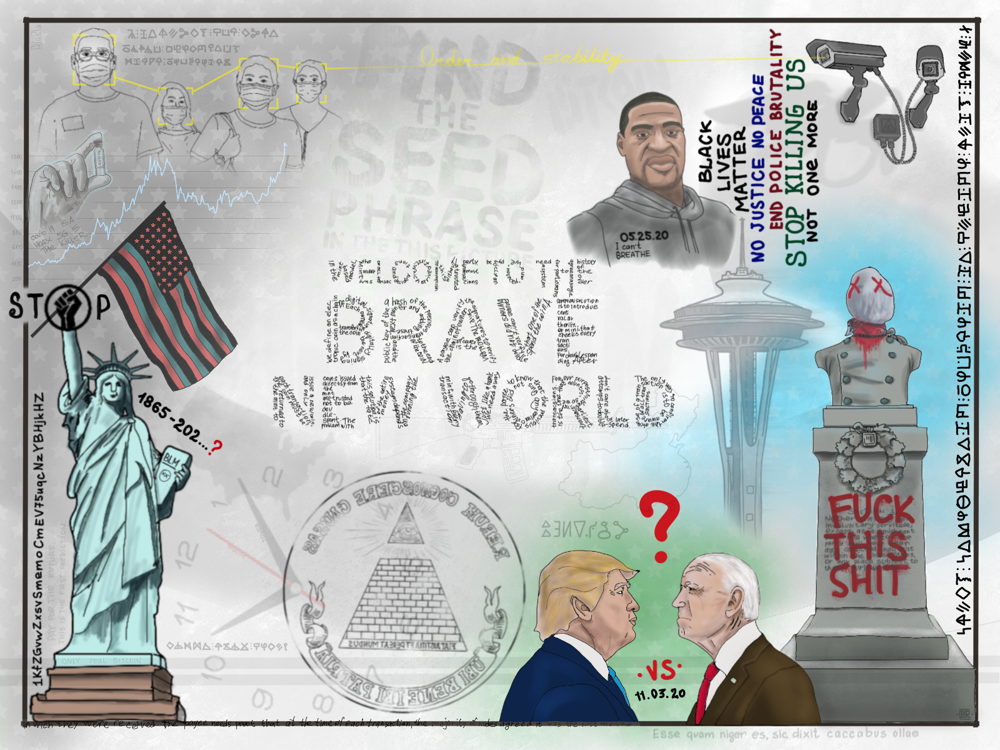


Below i post ideas that i've found long time ago on some else git [7] (that is now not available anymore) and/or reddit threads.

## Puzzle funding TX details

This image references a Bitcoin address [1KfZGvwZxsvSmemoCmEV75uqcNzYBHjkHZ](https://blockchair.com/bitcoin/address/1KfZGvwZxsvSmemoCmEV75uqcNzYBHjkHZ) in the bottom-left corner containing 0.2 BTC (when the author posted the image, the price of Bitcoin was approximately $10,000).


Puzzle been funded withing this tx [Bitcoin TX fcee21d44ee94c09869947c74b61669bf928358e9c2d1699fb075bb6ebf5d043](https://www.blockchain.com/explorer/transactions/btc/fcee21d44ee94c09869947c74b61669bf928358e9c2d1699fb075bb6ebf5d043) on 
10 May 2020 10:01:46 (4 P2SH inputs -> PZL address + change on else P2SH address where funds still remain untouched) 


## Mnemonic or Seed phrase

This picture looks like a typical crypto puzzle, that expect the solver to find a valid BIP39 seed phrase (3,6,9,12,15,18,21,24 words). But it also could be a bait (so be careful, dont spend your whole lifetime on it).

If its not a bait, and assumptions about the fact that you need to find a valid seed phrase is right - you will need to guess:
- Words to use.
- Number of words to use (typical valid lengths are : 3,6,9,12,15,18,21,24 words)
- Correct order of the words.

Date format in the puzzle are:
```
MONTH.DAY.YEAR
05.25.20
11.03.20
```

There are several commonly used methods for deriving an HD root key from a mnemonic phrase. Most likely, we should consider Electrum seed derivation and BIP39 seed derivation.

### BIP39

In BIP39, mnemonic phrases are generated from a [fixed list of 2,048 words](https://github.com/bitcoin/bips/blob/master/bip-0039/english.txt). In addition to the English word list, there are nine other official word lists for different languages.

The length of the BIP39 seed phrase could be 3 / 6 / 9 / 12 / 15 / 18 / 21 or 24 words.

The last word of a VALID 12-word mnemonic phrase is not "arbitrary" and not purely a checksum either. Since each word represents 11 bits (2¹¹ = 2,048), a 12-word phrase encodes a total of 132 bits. Of these, 128 bits represent the entropy (HD key), while the remaining 4 bits are used as a checksum. Consequently, the last word contains both the final bits of the entropy and the checksum.

Similarly, a 24-word phrase encodes 264 bits in total, consisting of 256 bits of entropy and an 8-bit checksum.

Also, very important, the phrase can further be extended with an optional user-defined word or password outside the BIP39 word list, which completely alters the resulting HD key.

### Electrum

Old electrum relied on its own mnemonic to private key conversion algorithm and its own word list (1626 words)

From [1.9.8 version](https://github.com/spesmilo/electrum/blob/1.9.8/lib/mnemonic.py) and [current version](https://github.com/spesmilo/electrum/blob/master/electrum/old_mnemonic.py) (same files).

## Puzzle creator

There are two “signatures”: one in the bottom-right corner and another in the top corner labeled “CHaRLy”.

Potentially it references [Charly Palmer](https://www.instagram.com/charlylpalmer/?hl=es) who could be the artist that composed the image.

[This image](https://www.instagram.com/p/CGED2CMBTzD/) was posted on the same day the BTC puzzle was published, along with the caption “I’m seeing red.”


Other assumptions: JR - Jean René.


## "BLM" - Black Lives Matter

[Black Lives Matter (BLM)]((https://en.wikipedia.org/wiki/Black_Lives_Matter)) is a decentralized political and social movement aimed at drawing attention to racism, discrimination, and racial inequality affecting Black people. Its main focus is on cases of police brutality and racially motivated violence against Black individuals.

[How Wikipedia Became a Battleground for Racial Justice JUNE 09, 2020](https://slate.com/technology/2020/06/wikipedia-george-floyd-neutrality.html)


## World map

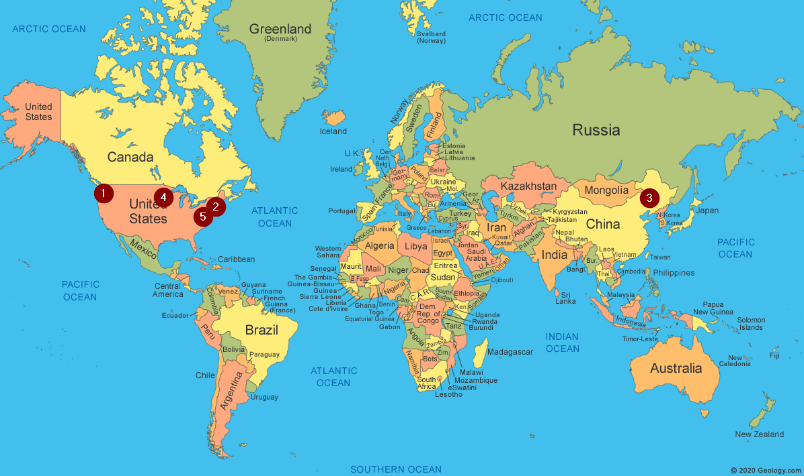

References:

1. Space Needle
2. Statue of Liberty
3. China (M16 location)
4. George Floyd died.
5. The White House


## Wikipedia leaks ?

User ["Beaneater00"](https://en.wikipedia.org/w/index.php?title=Special:Contributions/Beaneater00&target=Beaneater00&offset=20201016133238) edited at 05:25 the Wikipedia page "The pot calling the kettle black" the same that this BTC puzzle was published.

[Other user of interest](https://en.wikipedia.org/wiki/Special:Contributions/188.49.125.254)


## Table of ideas

The following table was generated using the available hints. It may contain incorrect words, but it provides a useful starting point:

```
| Order  | Word  | Description  |
|---|---|---|
| 1  | subject  | Appear in the section 1 (13th) or it could be 14? |
| 2  | camera  | Two cameras. Maybe could be "twin" word?  |
| 3  | tower  | 1+2 in clock  |
| 4  | mask  | 4 person with a mask  |
| 5  | police  | Line five  |
| 6  |   |   |
| 7  | liberty  | The crown with 7 points that symbolize the 7 seas and 7 continents  |
| 8  |   |   |
| 9  | eye  | 4+5 in the pyramid eye  |
| 10  | black  | Black day number X  |
| 11  | pyramid  | 5+6 inside the pyramid  |
| 12  | vote  | Reverse "versus"  |
| 13  | moon  | 12+1 in clock  |
| 14  |   |   |
| 15  |   |   |
| 16  | rifle  | M16 rifle from China |
| 17  | gold  | Graph shows 17 years of gold price evolution  |
| 18  |   |   |
| 19  | glove  | Appears with vaccine with CVD19 on it |
| 20  | apple  |   |
| 21  |   |   |
| 22  |   |   |
| 23  |   |   |
| 24  |   |   |
```

## 1. Gold prices chart

Puzzle:

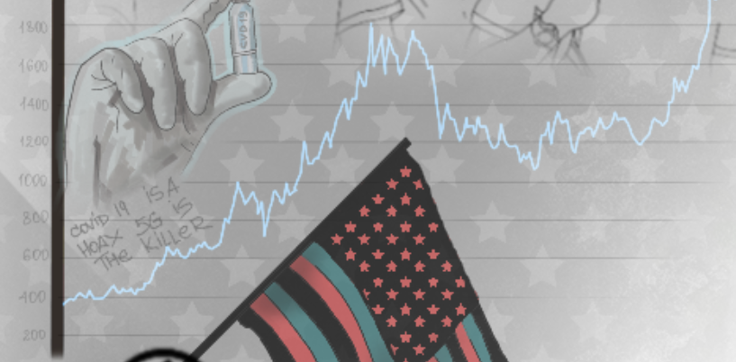

References:

This graph has a Y-axis ranging from 0 to 1800. It could represent the historical price of gold in U.S. dollars (The stars in the background suggest that it is paired to the U.S. dollar).

Note: Gold was near its all-time high at the time the graph appears to represent.

[Gold price chart](https://www.tradingview.com/chart/?symbol=TVC%3AGOLD)

August/2003 it is priced at     376.85$


September/2020 it is priced at 1954.80$

17 years from start to end

Monthly chart - seem to be a copy from TradingView.

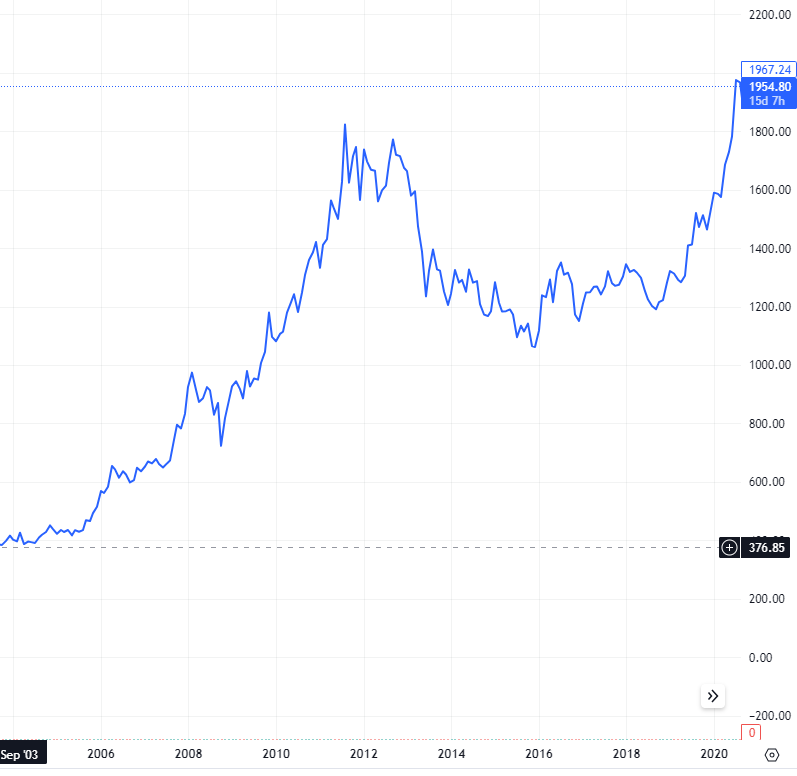

BIP39 words to consider:
- 803	gold
- 136	axis
- 1100	maximum
- 1364	price
- 1129	minimum


## 2. COVID19

Puzzle:

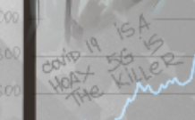

Hint:

```
COVID 19 IS A
HOAX 5G IS
THE KILLER
```

References:

This graffiti, found on 2020/apr/26, promotes false claims about 5G mobile phone technology.

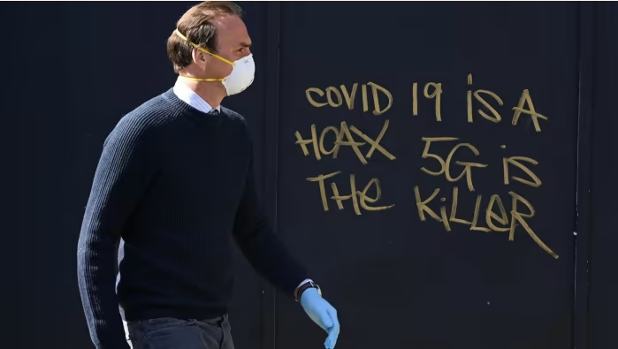

- [The Guardian](https://www.theguardian.com/world/2020/apr/26/5g-coronavirus-and-contagious-superstition)
- [FT](https://www.ft.com/content/1eeedb71-d9dc-4b13-9b45-fcb7898ae9e1)

average_student_81 pointed out: If you look closely at the area with word COVID you can see "1713" which corresponds to BIP39 word STOCK. (honestly, i still dont see that)

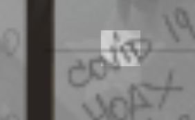

BIP39 words to consider:
- 1194	news
- 1309	phone
- 1140	mobile
- 1032	liberty


## 3. Donald Trump vs Joe Biden

Puzzle:

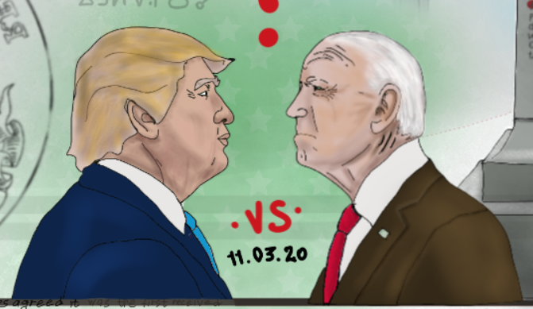

References:

Donald Trump - Red (Republican)

Joe Biden    - Blue (Democratic)

Question to consider: Why tie has the inverse color?

[The 2020 United States presidential election](https://en.wikipedia.org/wiki/2020_United_States_presidential_election) was the 59th quadrennial presidential election, held on Tuesday, November 3, 2020.

11.03.20

There is a Russian flag on Trump chest, maybe it hints to use Russian lang in puzzle

If you mirror ".vs.", you will obtain the number "12":


BIP39 words to consider:
- 451	debate
- 1968	vote


## 4. Thirteenth Amendment

Puzzle:

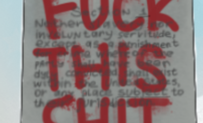

Hint:

```
Section 1:
Neither slavery nor
involuntary servitude,
except as a punishment
for crime whereof the
party shall have been
duly convicted, shall exist
within the United States,
or any place subject to
their jurisdiction.
```

... and the graffiti with the following text:

```
FUCK
THIS
SHIT
```

References:

[On December 18, 1865, the 13th Amendment](https://constitution.congress.gov/browse/essay/amdt13-S1-1/ALDE_00000992/) was adopted as part of the United States Constitution. The amendment officially abolished slavery, and immediately freed more than 100,000 enslaved people, from Kentucky to Delaware.

These words are underlined:

 * Section *1*
 * or any place *subject* to


## 5. Clock

Puzzle:
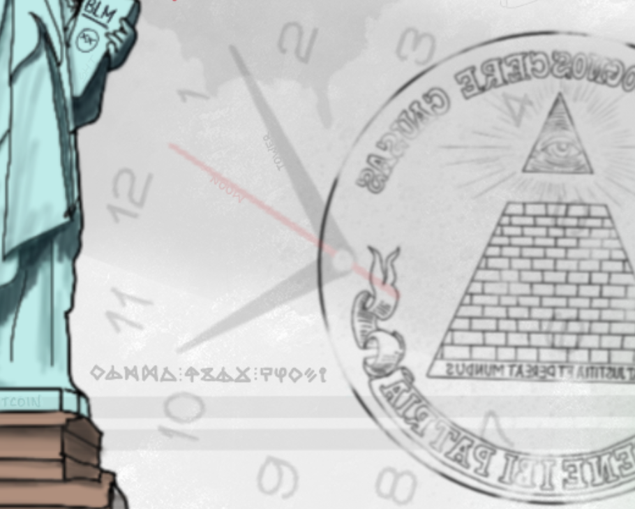


References:

The hands of the clock always lie midway between two adjacent numbers.

Given clock shows the next time: 10:07

the seconds hand is between 12 and  1  (12 + 1 =  13) 
the minutes hand is between 1  and  2  ( 1 + 2 =   3)
the hours   hand is between 10 and 11  (10 + 11 = 21)

the seconds hand has the "moon" word
the minutes hand has the "tower" word


## 6. Esse quam niger es...

Puzzle:


Hint:

```
Esse quam niger es, sic dixit caccabus ollae
```

References:

Russian: Смотри, какой ты черный, - сказал котелок горшку
English: Look how black you are, the bowler hat said to the pot.

"The pot calling the kettle black" is a proverbial idiom that may have originated in Spanish, with English versions first appearing in the early 17th century.

[Wiki "The pot calling the kettle black"](https://en.wikipedia.org/wiki/The_pot_calling_the_kettle_black)

Puzzle author potentially could have taken it from here [Wikipedia article](https://en.wikipedia.org/w/index.php?title=The_pot_calling_the_kettle_black&oldid=977612957) from 9 September 2020.

Also, could potentially be related to [Donald Trump vs Joe Biden](#3-donald-trump-vs-joe-biden).

BIP39 words to consider:
- 184	black
- 698	fire
- 14	accuse
- 1941	verb (proverb?)


## 7. COVID-19 Vaccine

Puzzle:
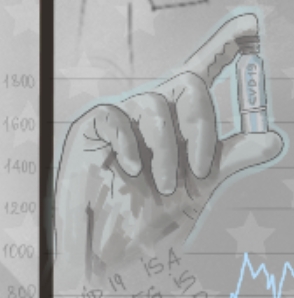

Hint:

```
CVD19
```

References:

Five letters, five fingers in the hand. Number 19 inside the vaccine

A [COVID-19 vaccine](https://en.wikipedia.org/wiki/COVID-19_vaccine)  is a vaccine designed to provide acquired immunity against SARS-CoV-2 (severe acute respiratory syndrome coronavirus 2), the virus responsible for coronavirus disease 2019 (COVID-19).

Authour could have read about it here [article from Wikipedia](https://en.wikipedia.org/w/index.php?title=COVID-19_vaccine&oldid=982231713)

Possible origin of the picture: [stock photo](https://www.bigstockphoto.com/es/image-405968219/stock-photo-female-doctor-in-medical-mask-and-a-stethoscope-on-shoulder-holding-vaccine-for-children-or-adults/).

BIP39 words to consider:
- 798	glove
- 839	hand


## 8. In wich...

Puzzle:
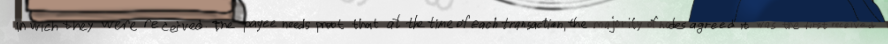

Hint:

```
in wich they were received. The payee needs proot that at the time of each transaction, the majority of nodes agreed it was the first received
```

References:

This text is taken from [Bitcoin Whitepaper](https://bitcoin.org/bitcoin.pdf) - page 2, header "2. Transactions".

```
To accomplish this without a trusted party, transactions must be
publicly announced [1], and we need a system for participants to agree on a single history of the
order in which they were received. The payee needs proof that at the time of each transaction, the
majority of nodes agreed it was the first received.
```

This hint begins with “in” and, in the full text, appears before the word “order”. It can be interpreted in two ways:

-The word comes before “order”.
-The word is “order”.

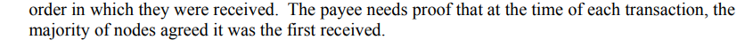

There are few typos in the quote:
- "wich" should be "which"
- "proot" should be "proof"

There are also words shown in different colors:
- "majority of no ....... was the first received"
- ".. of each transaction, the ....... des agreed it". ( Could be related to Data Encryption Standard (DES)? )

BIP39 words to consider:
- 1250	order
- 1379	proof
- 700	first
- 41	agree
- 1076	major
- 1437	receive


## 9. Space Needle

Puzzle:
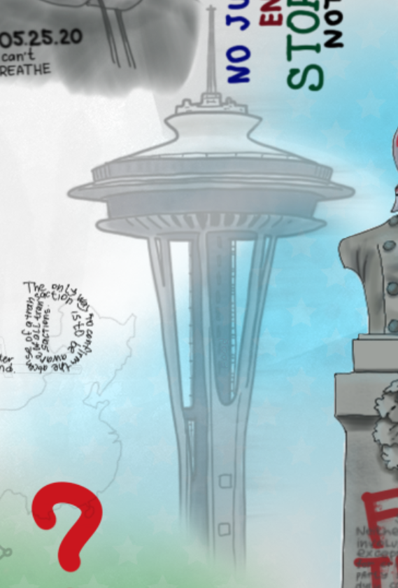

References:

The Space Needle is an observation tower located in Seattle, Washington, United States. It is considered an iconic symbol of the city and has been designated a Seattle landmark. Situated in the Lower Queen Anne neighborhood, it was constructed at the Seattle Center for the 1962 World’s Fair, which attracted more than 2.3 million visitors.

[Wiki] ( https://en.wikipedia.org/wiki/Space_Needle
https://en.wikipedia.org/w/index.php?title=Space_Needle&oldid=982262055)

"...and earthquakes of up to 9.0 magnitud ??..."

Letters located vertically form word "food" in the tower - potentially refer to:

"For decades, the hovering disk of the Space Needle was home to 2 restaurants 500 ft (150 m) above the ground: the Space Needle Restaurant, which was originally named Eye of the Needle, and Emerald Suite"

With the clock, marks the "11" number.

BIP39 words to consider:
- 727	food
- 1667	space
- 1183	need
- 650	eye


## 10. Gravity Falls

[Gravity Falls](https://en.wikipedia.org/wiki/Gravity_Falls) is an American animated television series blending mystery and comedy, created by Alex Hirsch for Disney Channel and Disney XD


[All books available](https://docs.google.com/document/d/1veWQhOrg15M0beBoigMwyMwilsDTjg2IEWPBWfhGv6M/edit). 

Bill Cipher was a triangular interdimensional demon who originally existed only in the Mindscape before managing to enter the real world.

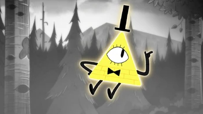

It's similar to the pyramid.


## 11. Runes (above Trump head)

Puzzle:


References:

Using "Gravity Falls" cypher:

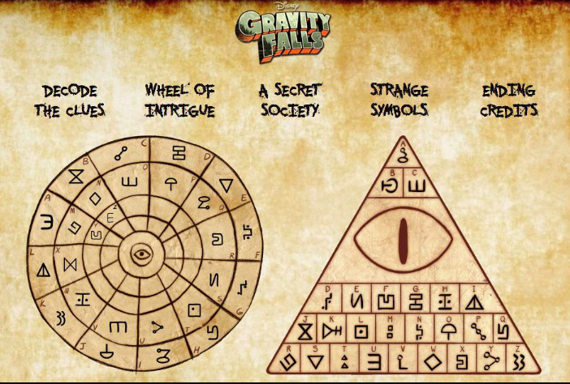

It converts to: "T U E S D A Y"


## 12. Statue of Liberty

Puzzle:
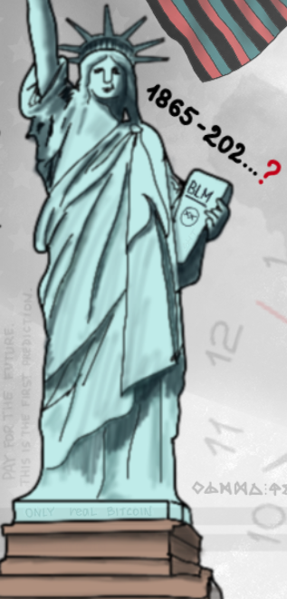

Hint:

The statue left hand holds a tablet with the next inscription

```
BLM

XX

SHT
```

SHT is a transparent text.

"BLM" probably is a reference to the Black Lives Matter movement. 

References:

The Statue of Liberty, officially titled Liberty Enlightening the World (French: La Liberté éclairant le monde), is a monumental neoclassical sculpture situated on Liberty Island in New York Harbor, New York City

https://en.wikipedia.org/wiki/Statue_of_Liberty

In her left hand, she holds a tablet inscribed with "JULY IV MDCCLXXVI" (July 4, 1776), the date of the adoption of the American Declaration of Independence. She also wears a crown with seven rays, symbolizing the seven seas and seven continents.

This could be connected to "1865 - 202...?" text on the right side:

"The idea for the statue originated in 1865, when French historian and abolitionist Édouard de Laboulaye proposed building a monument to commemorate the upcoming centennial of U.S. independence (1876), celebrate the resilience of American democracy, and honor the abolition of slavery"

Ideas:
- missing number, The end of freedom?
- It's a minus(subtraction) sign: 1865 - 202  = 1663?

The base of the Statue of Liberty displays the phrase "Only Bitcoin" beneath "Only real Bitcoin", suggesting that "Real" may be a seed word.

```
PAY FOR THE FUTURE
THIS IS THE FIRST PREDICTION
```

Similar to this [stock photo](https://www.shutterstock.com/es/image-vector/statue-liberty-on-white-background-94143832).

BIP39 words to consider:
- 757	future
- 1294	payment
- 1358	predict


Puzzle:
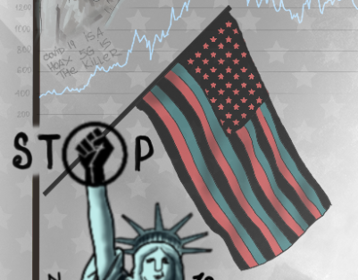

References:

[Black Power](https://en.wikipedia.org/wiki/Black_power) is a political slogan and term used to describe various related ideologies that seek self-determination for Black people. The earliest known use of the phrase “Black Power” appears in Richard Wright’s 1954 book Black Power.

The fist is mirrored relative to the original logo.

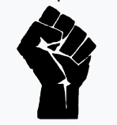

"stop" word could be related to a [original quote from Luci Hammans](http://www.womeninandbeyond.org/?p=24079&fbclid=IwAR1fnyivzERwvc7AzmjFP3yp0laEbzHzWksaLLCSd8Oxn5nvFOEH7uHeUVo):

"As we marched today, we took steps of resilience, because to protest in Barbados needs permission and requests […] the Public Order Act was created to stop Black Power protests in Barbados, and to appease the political and economic elite in 1937, because we were not passive then and we are not passive now!"

[The national flag of the United States](https://en.wikipedia.org/wiki/Flag_of_the_United_States), commonly known as the American flag or U.S. flag, features thirteen horizontal stripes alternating red and white, with a blue canton (the union) containing fifty white five-pointed stars arranged in staggered rows. The 50 stars represent the 50 U.S. states, while the 13 stripes symbolize the thirteen British colonies that declared independence from Great Britain during the American Revolutionary War.

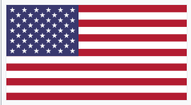

The US flag has different stripes compared with the original one. This is because this flag is referencing to [Pan-african flag. African America flag. Juneteenth, Freedom Day. African-American Independence Day, June 19](https://www.shutterstock.com/es/image-vector/panafrican-flag-african-america-juneteenth-freedom-1412994029?consentChanged=true)

[Juneteenth (officially Juneteenth National Independence Day)](https://en.wikipedia.org/wiki/Juneteenth) is a federal holiday in the United States that marks the end of slavery. Its name combines “June” and “nineteenth” and refers to June 19, 1865, when, after the American Civil War, Major General Gordon Granger issued an order in Texas enforcing the Emancipation Proclamation, effectively ending slavery there.


Flags symbolize the unity of governance, people, and territory. This flag was designed to represent and unify Black people in America and across the world.

-Red: represents the blood shared among people of Black African ancestry and the blood shed in the struggle for liberation
-Black: represents the people themselves, affirming their existence as a nation, even if not a nation-state
-Green: represents the rich natural wealth and vitality of Africa, the Motherland

Although both flags serve as symbols of pride and liberation for Black people, the Juneteenth flag was specifically designed to commemorate the holiday, while the Pan-African flag is more broadly used to represent Black people worldwide in a variety of contexts.

If you count the stars, there are 44 instead of 50 (the number that represents the current U.S. states). This may have several possible interpretations:
-The 44-star flag: This version became the official United States flag on July 4, 1891. A star was added after Wyoming’s admission (July 10, 1890), and this design remained in use for about five years.
-Possible reference to BIP44: It could also be interpreted as a reference to the derivation path in the BIP44 specification, typically written as m/44'/0'/0'/0.

BIP39 words to consider:
- 1391	punch
- 184   black
- 1355  power


## 13. Trade war

Puzzle:
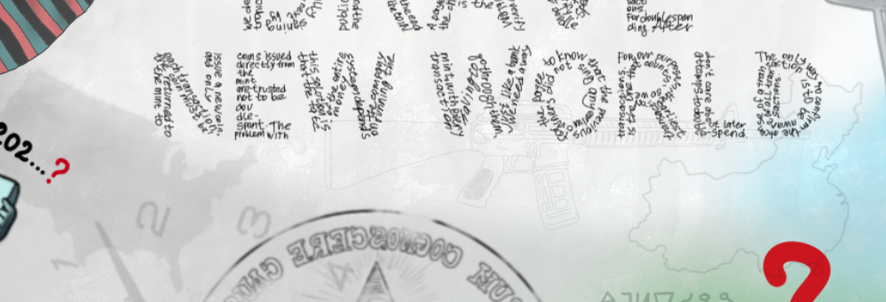

References:

This piece could reference [China and Unitad States trade war](https://en.wikipedia.org/wiki/China%E2%80%93United_States_trade_war).

The [M16 rifle](https://en.wikipedia.org/wiki/M16_rifle) is aimed precisely at the location where the Norinco CQ, the Chinese variant of the M16, is manufactured.

BIP39 words to consider:
- 832	gun
- 1987	weapon
- 1846	trade
- 450	deal
- 1486	rifle


## 14. Welcome to the brave new world

Puzzle:
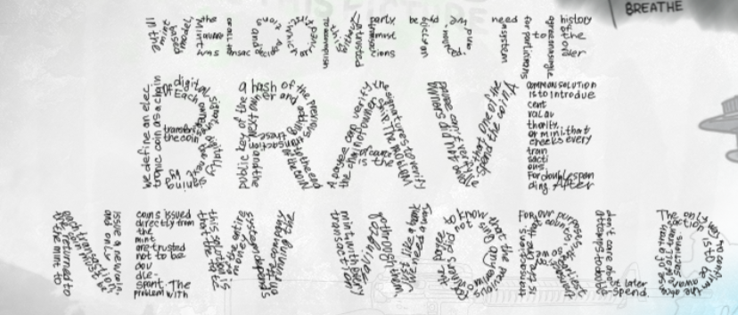

Hint:

```
WELCOME TO THE
BRAVE
NEW WORLD
```

And "WELCOME TO THE" text contain:

```
W) in the mint based model,
E) the mint was aware
L) of all transac
C) tions and decided
O) which arrrived first.
M) To accomplish this without a trusted
E) party, transactions must

T) be publicly an
O) nounced, and we

T) need a system
H) for participants to agree on a single 
E) history of the order
```

And "BRAVE NEW WORLD" text contain:

```
B)...
R)...
A)...
V)...
E)...

N)...
E)...
W)...

W)...
O)...
R)...
L)...
D)...
```

References:

There are typos:
- introdue
- participans
- doudle (should be double)
- sing (instead of sign)
- abcense (instead of absence)

[Brave New World is a dystopian novel](https://en.wikipedia.org/wiki/Brave_New_World) written by English author Aldous Huxley in 1931 and published in 1932.

This novel consists of eighteen chapters, which may be interpreted as a reference to an 18-word seed phrase. The book can be read [here](https://www.huxley.net/bnw/one.html)

Phrase "order and stability" is found in this book:

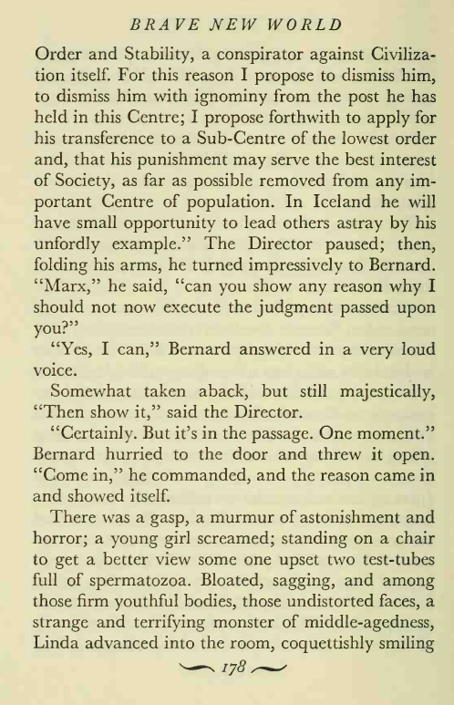


[The pilot episode](https://popoff.us/brave-new-world-s01-e01-pilot-98c164115bd), which introduces viewers to New London, immediately establishes three core rules: no privacy, no family, and no monogamy. The episode can be viewed here: https://popoff.us/brave-new-world-s01-e01-pilot-98c164115bd

Interesting facts:
- "WELCOME TO THE" only one line creates each letter
- "BRAVE NEW WORLD" uses two lines to create each letter.

BIP39 words to consider:
- 2030	world
- 1995	welcome
- 1280	paper (bitcoin whitepaper)


## 15. Cameras

Puzzle:
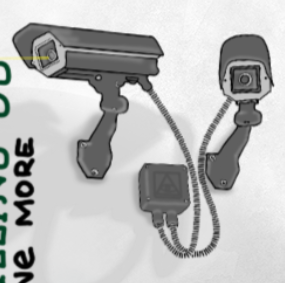

References:

Closed-circuit television (CCTV), also known as video surveillance, is shown here with two cameras connected to a box featuring an “eye” symbol.

The cameras cast a shadow, while the other objects do not.

References:
-[mirror free stock image reference from fckuen user](https://www.gettyimages.es/detail/ilustraci%C3%B3n/twin-outdoor-security-camera-cctv-ilustraciones-libres-de-derechos/98031609)


## 16. Black lives matter

Puzzle:
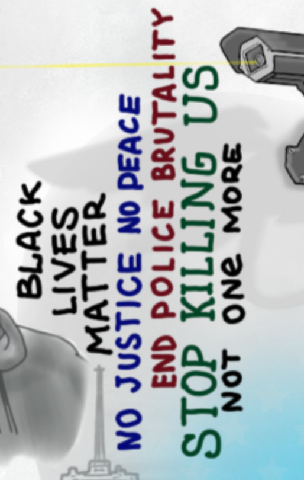

Hint:

```
BLACK
LIVES
MATTER
NO JUSTICE NO PEACE
END POLICE BRUTALITY
STOP KILLING US
NOT ONE MORE
```

References:

[No Justice, No Peace: America's Uprising against Police Brutality and Racism | Foreign Correspondent](https://www.youtube.com/watch?v=kt_M3FAmg1Y)

Pay attention to colors - each line has its own colour: Blue, Red and Green and Black.


## 17. George Floyd

Puzzle:
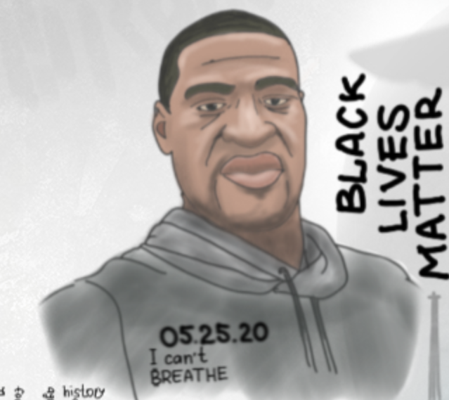

Hint:

```
05.25.20
I can't
BREATHE
```

Original photos:

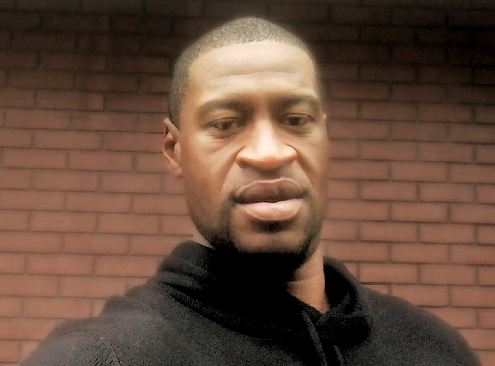

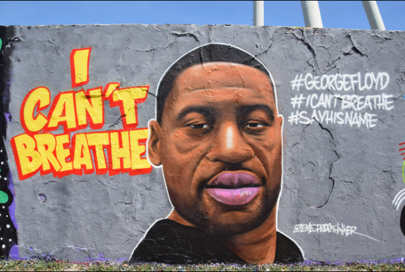

References:

On May 25, 2020, George Floyd, a 46-year-old Black man, died in Minneapolis, Minnesota, United States, during an encounter with Derek Chauvin, a 44-year-old white police officer, in which Chauvin was later convicted for murder.

[Wikipedia reference](https://en.wikipedia.org/wiki/Murder_of_George_Floyd)

BIP39 words to consider:
- 1035	life
- 1342	police
- 1559	security


## 18. Pyramid

Puzzle (mirrored image):

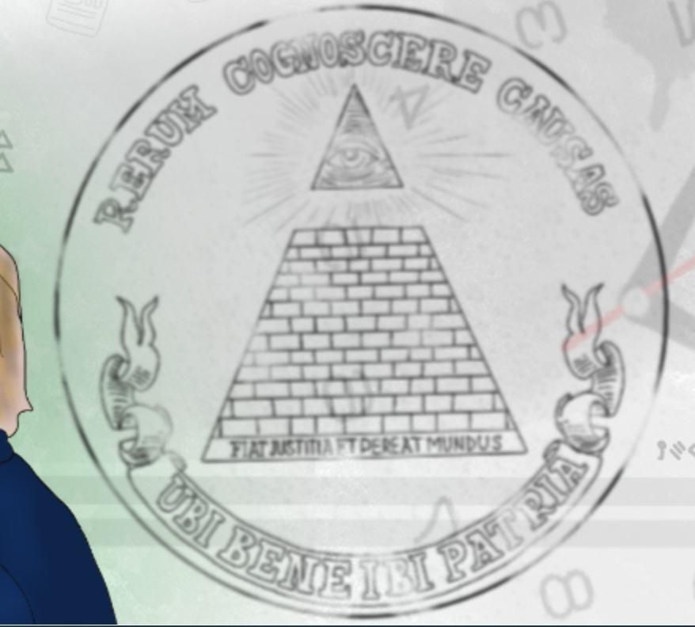

Hint:

```
RERUM COGNOSCERE CAUSAS
FIAT JUSTITIA ET PEREAT MUNDUS
UBI BENE IBI PATRIA
```

References:

There are three quotes in Latin:

"Felix, qui potuit rerum cognoscere causas"
"Fortunate, who was able to know the causes of things"

[Wiki](https://en.wikipedia.org/wiki/Felix,_qui_potuit_rerum_cognoscere_causas)

It is verse 490 of Book 2 of the Georgics (29 BC), written by the Latin poet Virgil (70–19 BC).

"Fiat iustitia, et pereat mundus" is a Latin phrase, meaning "Let justice be done, though the world perish".

[Wiki](https://en.wikipedia.org/wiki/Fiat_iustitia,_et_pereat_mundus)

Ubi bene ibi patria (“The homeland is where life is good”; literally, “where it is good, there is the fatherland”) is a Latin expression. It is also reminiscent of a fragment (Teucer, fr. 291) by the Roman tragic poet Marcus Pacuvius (c. 220–130 BC), which is quoted by Cicero (106–43 BC).

[Wiki](https://en.wikipedia.org/wiki/Ubi_panis_ibi_patria)

This also appears to reference the Great Seal, featuring the floating-eye pyramid depicted on the U.S. dollar bill:

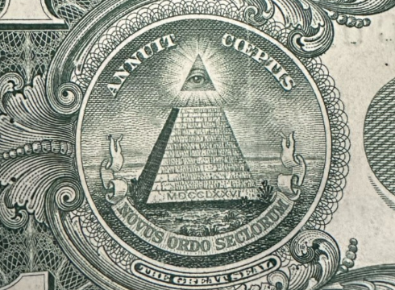

The uncapped pyramid may be interpreted as a metaphor for a nation still in development at the time the design was created. The NIEHS also notes that the design was intentional, and Charles Thomson—one of the designers of the Great Seal—described it as representing “strength and duration.”

The eye positioned above the pyramid is often interpreted as a symbol of divine providence in the founding of the United States. This interpretation is further supported by the inscriptions “ANNUIT COEPTIS” (“God has favored our undertaking”) and “NOVUS ORDO SECLORUM” (“A new order for the world”).


## 19. Bust of King Leopold II

Puzzle:

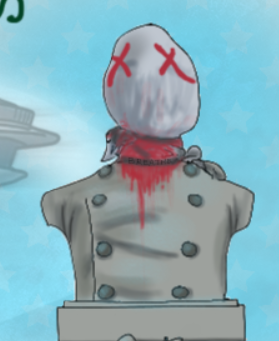

References:

During Black Lives Matter protests in Belgium, activists defaced a bust of King Leopold II, who is widely associated with the colonial-era atrocities in the Congo, where millions of people were killed.

The statue was covered in red paint to symbolize blood and was gagged with a cloth reading “I can’t breathe.” The photo was taken on June 4, 2020:

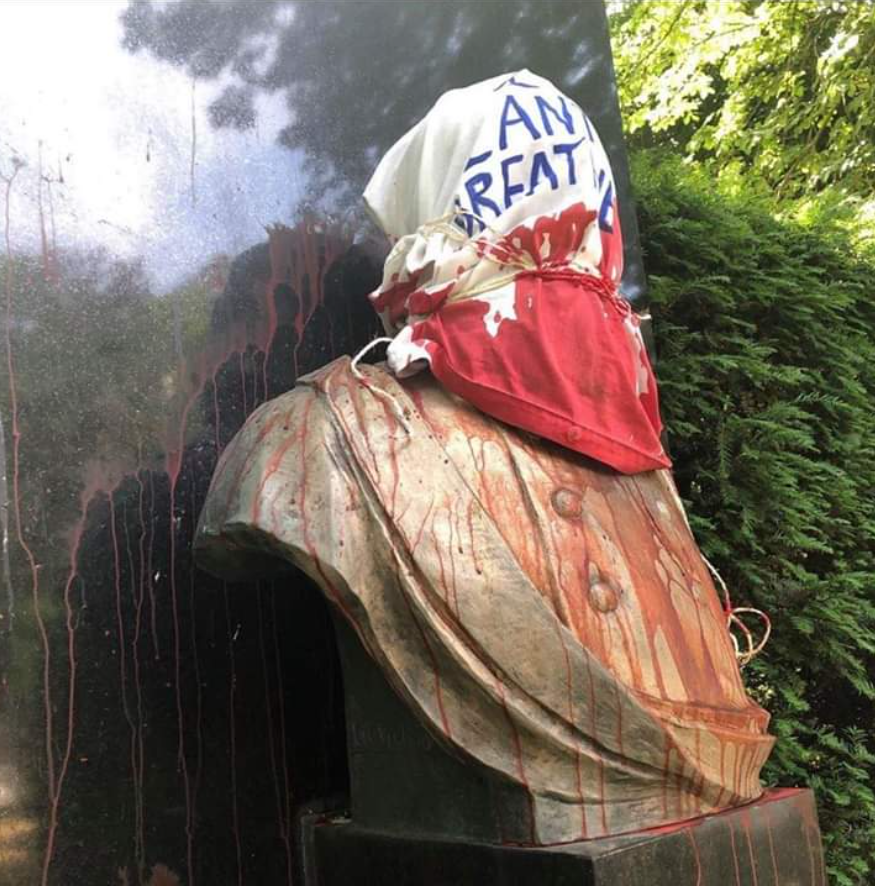

[Source Twitter](https://twitter.com/redfishstream/status/1268471631481057281)

[Leopold II](https://en.wikipedia.org/wiki/Leopold_II_of_Belgium) (French: Léopold Louis Philippe Marie Victor; Dutch: Leopold Lodewijk Filips Maria Victor; 9 April 1835 – 17 December 1909) was the second King of the Belgians, ruling from 1865 to 1909, and also the founder and sole owner of the Congo Free State from 1885 to 1908.

In the puzzle image (not the official photo), there is an “XX” on his head, which may be interpreted as representing the number 20.

BIP39 words to consider:
- 1556	second


## 20. Rune right

Puzzle (rotated):

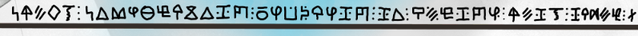

References:

Runes on the right:
```
здесь зашифрованы биткоины на чёрный день номер X.
```

```
"here are encrypted bitcoins for a rainy day number X."
```

Note that “здесь” can also be translated as “there,” which is a word in the BIP39 list.

And "чёрный день" could be translated to:
- black day
- rainy day

Runes from above:
```
Я надеюсь что сюда будут присылать много биткоинов.
```

```
 "I hope that many bitcoins will be sent here."
```

Runes at the bottom
```
"Сумма двух чисел"
```
```
 "Sum of two numbers".
```

## 21. Order using clock numbers


Puzzle:

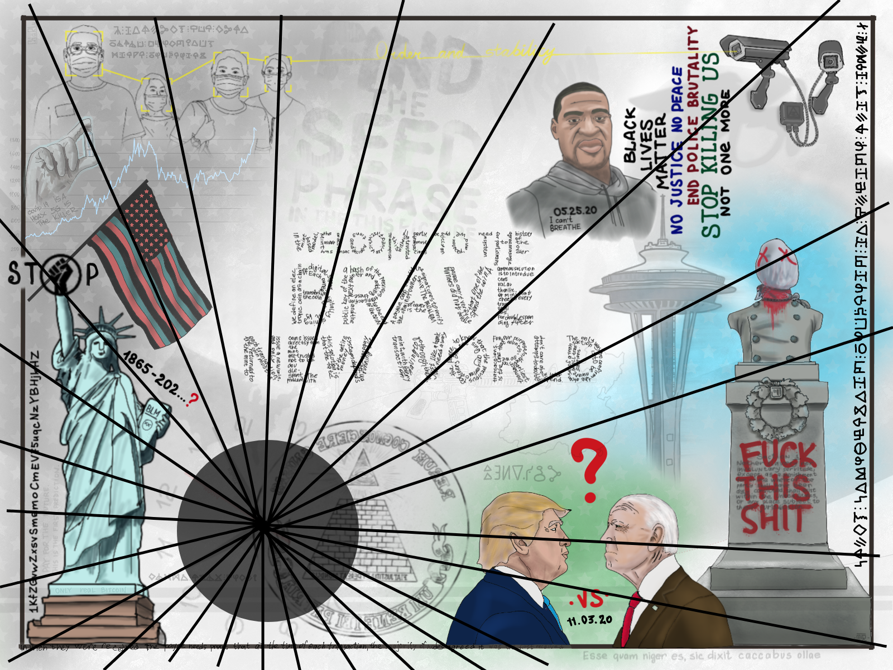

References:

One possible interpretation is that the clock numbers indicate an order for a seed phrase.


## P.S.
Thank you for spending time on my notes, i hope it was not totally useless and you've found something interesting. 

Any ideas\questions or propositions you may send to generalizatorSUB@gmail.com.

-------------------------------------------------------------------------
### References:
[1] Reddit topic #1 - https://www.reddit.com/r/bitcoinpuzzles/comments/jrr7mo/is_this_puzzle_still_valid_is_this_image_correct/

[2] Reddit topic #2 - https://www.reddit.com/user/stsh_n/comments/j79zvj/bitcoin_puzzle_2000/

[3] Reddit topic #3 - https://www.reddit.com/r/CryptoPuzzlers/comments/mbdogq/02_btc_puzzle/

[4] BTC32 Bitcointalk topic - https://bitcointalk.org/index.php?topic=1306983.0

[5] 0.2 BTC pzl Bitcointalk topic - https://bitcointalk.org/index.php?topic=5404767.0

[6] 0.2 BTC address - https://www.blockchain.com/id/btc/address/1KfZGvwZxsvSmemoCmEV75uqcNzYBHjkHZ

[7] [GIT with ideas] - https://github.com/AlberTajuelo

-------------------------------------------------------------------------
### Support


**BTC**:  `1QKjnfVsTT1KXzHgAFUbTy3QbJ2Hgy96WU`

**LTC**:  `LNQopZ7ozXPQtWpCPrS4mGGYRaE8iaj3BE`

**DOGE**: `DQvfzvVyb4tnBpkd3DRUfbwJjgPSjadDTb`
